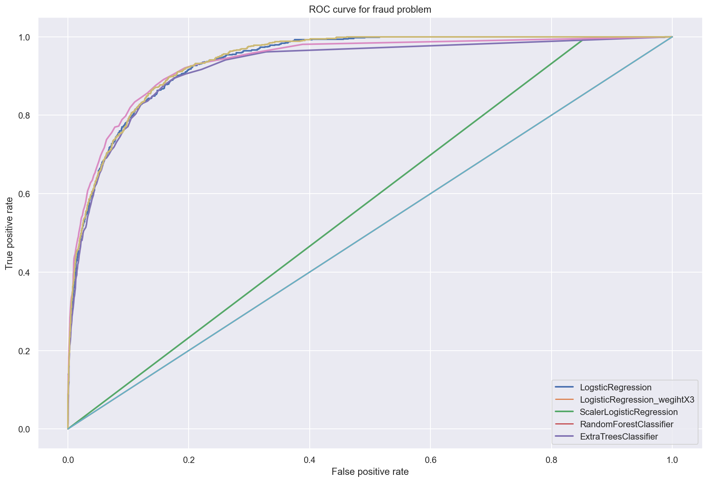
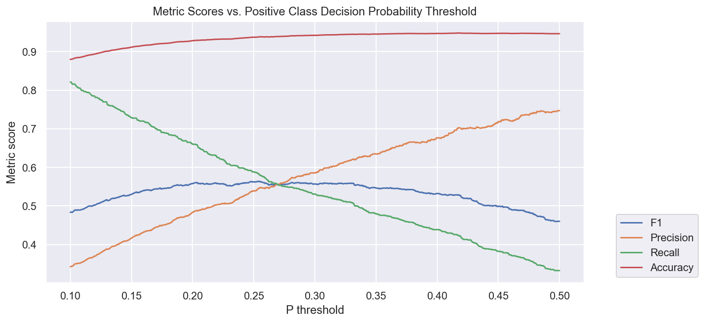

# Individuals Annual Income In The USA
## Introduction: 
The goal of the project is to build a classification model to accurately predict whether annual income is more than 50k or less than 50k. 
## process: 
After we imported the data we have done several EDAs and Data cleaning, then we set a baseline by building a kNN model. After that we constructed other models such as logistic regression,logsticRegression_weight3, Random Forest, and other models, then we started to compare between them. 

## Graphs:
### ROC:

The ROC graph shows Area under the curve of models that have been built and tested.
### Logistic Regression Model best F1 score at prob decision threshold:

The graph shows the intersaction between recall,percision and F1 score which means that is the best thershold point in logistic model at 0.254
